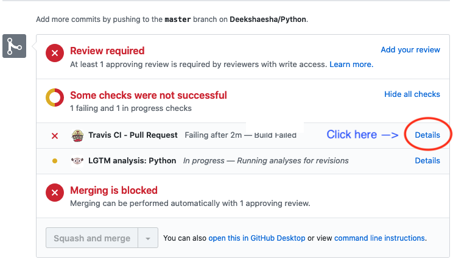

# Travis CI test are failing
### How do I find out what is wrong with my pull request?
1. In your PR look for the failing test and click the `Details` link: 
2. On the next page, click the `build has failed` link: 
3. Now scroll down and look for `red` text in the test log.
